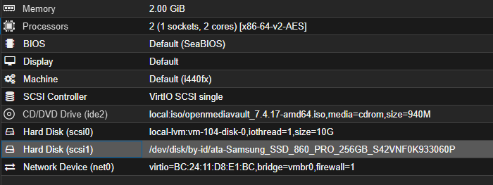

[openmediavault]: https://www.openmediavault.org 

# Preparing NAS server

>[openmediavault] openmediavault is the next generation network attached storage (NAS) solution based on Debian Linux. It is a simple and easy to use out-of-the-box solution that will allow everyone to install and administrate a Network Attached Storage without deeper knowledge.

## VM Parameters:
>CPU: 2 vCPU  
RAM: 2048 MB  
Disk: 32 GB

testing