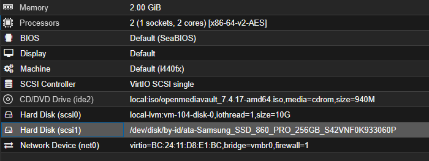

[openmediavault]: https://www.openmediavault.org  

# Preparing the NAS Server

>[openmediavault] is the next-generation network-attached storage (NAS) solution based on Debian Linux. It is a simple and easy-to-use out-of-the-box solution that allows anyone to install and manage a Network Attached Storage system without requiring deep technical knowledge.

## VM Parameters:
>CPU: 2 vCPU  
RAM: 2048 MB  
Disk: 32 GB

Before installation, I want the VM to have direct access to the SSD. To achieve this, follow these steps:

1. Use the Proxmox shell to find the ID of the disk you want to attach to the VM.
```sh
ls -l /dev/disk/by-id/
```
My result:  
`ata-Samsung_SSD_860_PRO_256GB_S42VNF0K933060P`

2. Next, edit the configuration file. In my case, the VM has ID 104:
```sh
nano /etc/pve/qemu-server/104.conf
```
And add the following line:
```sh
scsi1: /dev/disk/by-id/ata-Samsung_SSD_860_PRO_256GB_S42VNF0K933060P
```
This will give the VM direct access to the disk.  


### Configuring openmediavault via the Web Interface

After logging in, changing the admin password, and performing system updates, I completed the following steps:

- Created user `s1m6n`  


- Formatted the disk  
  


- Created the file system  
  


- Mounted the file system  
  
Result:  


- Enabled SMB  


- Created a shared folder  
  


Thanks to this configuration, the newly created network drive can be mounted using the credentials of the user `s1m6n`.  
  
  

